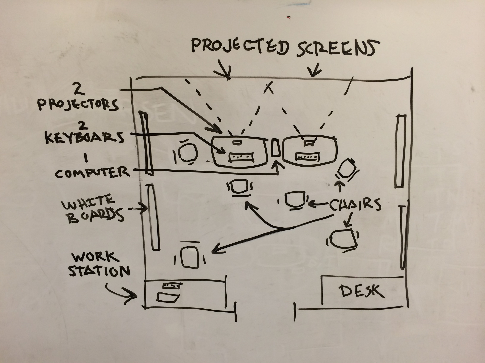

<!-- Copy and paste the converted output. -->

<!-----
NEW: Check the "Suppress top comment" option to remove this info from the output.

Conversion time: 2.921 seconds.

Using this Markdown file:

1. Paste this output into your source file.
2. See the notes and action items below regarding this conversion run.
3. Check the rendered output (headings, lists, code blocks, tables) for proper
   formatting and use a linkchecker before you publish this page.

Conversion notes:

* Docs to Markdown version 1.0β29
* Sat Jan 30 2021 22:35:01 GMT-0800 (PST)
* Source doc: [ENJA] Mob Programming – A Whole Team Approach by Woody Zuill
* This document has images: check for >>>>>  gd2md-html alert:  inline image link in generated source and store images to your server. NOTE: Images in exported zip file from Google Docs may not appear in  the same order as they do in your doc. Please check the images!

----->

This is a translated article. You can access the original here:  
[Mob Programming – A Whole Team Approach by Woody Zuill](https://www.agilealliance.org/resources/experience-reports/mob-programming-agile2014/)

# モブプログラミング-チーム全体のアプローチ by Woody Zuill

Translated by Yasunobu Kawaguchi, Ikuo Suyama and Ken Matsumoto

<!-- ## 1. INTRODUCTION -->
## 1. はじめに

<!-- [Mob programming](https://www.agilealliance.org/glossary/mob-programming/) is a software development approach where the whole team works on the same thing, at the same time, in the same space, and at the same computer. This is similar to [pair programming](https://www.agilealliance.org/glossary/pairing/) [PAIR], where two people sit at the same computer and collaborate on the same code at the same time. With Mob Programming we extend the collaboration to everyone on the team, while still using a single computer for writing the code. \ -->
[モブプログラミング](https://www.agilealliance.org/glossary/mob-programming/)とは、チーム全体が同じものを、同じ時間に、同じ空間で、同じコンピュータで作業するソフトウェア開発のアプローチです。これは[ペアプログラミング](https://www.agilealliance.org/glossary/pairing/)[PAIR]に似ています。ペアプログラミングは、2人の人が同じコンピュータの前に座り、同時に同じコードを共同作業するというものです。モブプログラミングでは、1台のコンピュータを使ってコードを書きながら、チームの全員にコラボレーションの範囲を広げています。

<!-- In addition to software coding, the team works together to do almost all the work a typical software development team tackles, such as defining stories, designing, testing, deploying software, and working with the customer (in our environment we call our internal customers our “Partners”, which is similar in nature to a [product owner](https://www.agilealliance.org/glossary/product-owner/)). Almost all work is handled as “working meetings” or workshops, and all the people involved in creating the software are considered to be team members, including our Partners. We work this way more or less all day long, every day. \ -->
ソフトウェアのコーディングに加えて、ストーリーの定義、設計、テスト、ソフトウェアのデプロイ、顧客との作業など、一般的なソフトウェア開発チームが取り組むほぼすべての作業をチームで行います（私たちの環境では、[プロダクトオーナー](https://www.agilealliance.org/glossary/product-owner/)と似たような役割の社内の顧客のことを「パートナー」と呼んでいます）。ほとんどすべての作業は「ワーキングミーティング」や「ワークショップ」として行われ、パートナーを含めソフトウェアの作成に関わるすべての人がチームメンバーと考えられています。多かれ少なかれ、一日中毎日このように仕事をしています。

<!-- In other words, this is an evolutionary step beyond the Extreme Programming [EXT] concept of pair programming. We strive to accentuate and amplify concepts such as face-­‐to-­‐face and side-­‐by-­‐side communication, team alignment, collaboration, whole team involvement, continuous code review, and the “self-­‐organizing team”, to name a few. \ -->
言い換えれば、ペアプログラミングというエクストリームプログラミング[EXT]の概念を超えた進化の一歩です。私たちは、いくつかの例を挙げれば、同席かつ対面のコミュニケーション、チームの連携、コラボレーション、チーム全体の関与、継続的なコードレビュー、「自己組織化チーム」などの概念を強調し、増幅させるように努めています。

<!-- In this experience report I describe why we work this way, our basic setup, some of the benefits we have seen from Mob Programming, and how we work this way including a few critical practices, such as the “Driver/Navigators” teamwork model that we’ve adopted that makes it possible for us to work as a “whole team” all day, every day. \ -->
この体験レポートでは、なぜこのような働き方をしているのか、基本的なセットアップ、モブプログラミングから得られたメリット、そして「ドライバー/ナビゲーター」チームワークモデルなどの、「チーム全体」として一日中働くために重要ないくつかのプラクティスを説明します。

<!-- ## 2. HOW WE STARTED -->
## 2. どのようにして始めたか

<!-- We did not set out to invent a new way to work, or to extend the idea of pair programming. We simply noticed something that was working well for us and expanded on it. \ -->
私たちは、新しい働き方を発明しようとしたわけでも、ペアプログラミングのアイデアを拡張しようとしたわけでもありません。私たちは単に、私たちにとってうまく機能していることに気付き、それを拡張しただけです。

<!-- Prior to discovering and adopting Mob Programming as our general work style, we followed a practice of having frequent retrospectives and continuously working at making things better. We had been learning pair programming and Test-­‐Driven Development [TDD] and holding practice sessions using a Coding Dojo [DOJO] approach (where everyone uses a single computer with a projector and passes the keyboard around) to practice these skills. Several of the team members had started using TDD and pair programming, along with other new skills to some degree in their daily work. \ -->
モブプログラミングを発見し、一般的なワークスタイルとして採用する前は、頻繁にふりかえりを行い、より良いものを作るために継続的に取り組むことを実践していました。ペアプログラミングやテスト駆動開発[TDD]を学んだり、コーディング道場[DOJO]を使った練習会(全員が1台のパソコンとプロジェクターを使い、キーボードを回して練習する)を行ったりしていました。チームメンバーの何人かは、TDDとペアプログラミングをはじめ、他の新しいスキルも含めて、日々の仕事の中である程度使い始めていました。

<!-- At one point we needed to prepare to restart work on a project that was previously in development but had been put “on hold” for several months while some other more critical work was being taken care of. We gathered in a typical meeting room to take a look at this project and decide on how to take on the work. A few of the team members and a contractor had previously worked on this project, but the rest of the team had not. \ -->
ある時、以前開発中だったものの、他のクリティカルな作業のため数ヶ月間「保留」にされていたプロジェクトを再開する準備をする必要がありました。私たちはよくある会議室に集まり、このプロジェクトを見て、どのように仕事を引き受けるかを決めました。チームメンバーの数名と契約社員はこのプロジェクトに携わったことがありましたが、それ以外のメンバーはありませんでした。

<!-- During the initial meeting we were familiarizing each other with the project. We started by taking a look at some code, database tables, documents, and a few other details of the project. At some point in this review/refresh meeting we started trying out a few ideas, writing tests, changing code, and discussing how to proceed. As we had all been learning and practicing pair programming over the last few months it was very natural for us start to pass the keyboard around as we worked. \ -->
最初のミーティングでは、プロジェクトに慣れようとしました。私たちは、いくつかのコード、データベースのテーブル、ドキュメント、プロジェクトの他のいくつかの詳細を見ることから始めました。このレビュー/リフレッシュミーティングでは、いくつかのアイデアを試してみたり、テストを書いてみたり、コードを変更してみたり、今後の進め方について話し合ったりしました。ここ数ヶ月間、ペアプログラミングを学び、練習してきたので、キーボードを渡しながら作業をするのはとても自然なことでした。

<!-- After several hours another group was scheduled to use the meeting room we had occupied, so we quickly grabbed up our stuff and headed off to find an unoccupied meeting room. We held a “mini-­‐[retrospective](https://www.agilealliance.org/glossary/milestone-retrospective/)” [RETR] at the end of the day and we all felt the experience was very productive. We decided to arrange for meeting rooms to use the next day so we could continue to gather and work together in the same way. \ -->
数時間後、別のグループが私たちが使用していた会議室を使用することになったので、私たちは急いで荷物をまとめ、空いている会議室を探しに向かいました。その日の最後に「ミニ・[レトロスペクティブ](https://www.agilealliance.org/glossary/milestone-retrospective/)」[RETR]を行いましたが、全員がとても充実した経験になったと感じていました。そこで、翌日も同じように集まって活動できるように、会議室を手配することにしました。

<!-- We followed this same basic pattern of working together moving from meeting room to meeting room over next two weeks. Each day we reviewed how the day went, and each day we decided we wanted to keep working “as a team”. We felt we were rapidly improving our ability to communicate well, increase our knowledge, and find better solutions. We were gaining a deep and shared understanding of the project and the technologies involved. About this time we decided to call what we were doing “Mob Programming.” \ -->
それから２週間、私たちは、会議室から会議室へと移動しながら一緒に仕事をするという基本的なパターンを踏襲しました。毎日、その日の様子を振り返り、「チームとして」仕事を続けたい、ということを決めました。私たちは、上手にコミュニケーションをとり、知識を増やし、より良い解決策を見つける能力が急速に向上していると感じました。私たちは、プロジェクトとそれに関わる技術について、深く、共通の理解を得ることができました。この頃、私たちは自分たちがやっていることを "モブプログラミング "と呼ぶことに決めました。

<!-- Our biggest problems were things like the disruption of moving from room to room, issues with network connections in some meeting rooms, varying quality and usability of the computers and projectors, and other similar logistic and equipment issues. We also found we were experiencing ergonomic problems such as getting sore backs and necks from poor posture and the bad orientation of tables and chairs in relation to the projected screen at the end of the table. We were also getting headaches from squinting at low resolution or poor quality projected computer screens. \ -->
私たちの最大の問題は、部屋から部屋への移動に伴う中断、一部の会議室でのネットワーク接続の問題、コンピュータやプロジェクターの品質や使い勝手の違いなどの、運営や設備の問題でした。また、姿勢の悪さから腰や首が痛くなったり、テーブルや椅子の向きがテーブルの端に投影されたスクリーンとの関係が悪かったりと、人間工学的な問題を抱えていることもわかりました。また、低解像度や質の悪いプロジェクタでコンピュータの画面を目を細めて見ると、頭痛がすることもありました。

<!-- After the third or fourth week we were able to find a “permanent” work area we could use every day for a few months and had started to solidify some of our work practices. We were discovering ways to deal with the ergonomic problems as well, which I’ll share in a following section. \ -->
3～4週目には、数ヶ月間毎日使える「常設」の作業場を見つけることができ、仕事のやり方もある程度固まり始めていました。人間工学的な問題にも対処する方法を発見していましたが、それは次のセクションで紹介します。

<!-- We have successfully delivered many projects and enhancements over the last 3 years since we started doing “Mob Programming”. While we now have a permanent work area and have made many incremental improvements to the way we work, we have continued to follow the basic pattern of collaborating as a whole team working at a single computer. \ -->
私たちは、「モブプログラミング」を始めてから3年間、多くのプロジェクトや機能拡張を成功させてきました。今では常設の作業スペースを確保し、仕事の進め方を少しずつ改善してきましたが、チーム全体で1台のコンピュータで作業をするという基本的なパターンを守り続けてきました。

<!-- ## 3. WHY WE WORK THIS WAY -->
## 3. なぜこのような働き方をするのか

<!-- We work this way because the team decided to work this way. This is an important concept for us: The team doing the work can best determine how to do that work. We were not told to work this way. We have the freedom and responsibility to decide how we want to work. Having discovered that continuously working and collaborating together all day, every day, was working well for us continuing to do so was the natural next step. We continue to pay attention to what is working, and we frequently “tune and adjust” as needed. Our mantra is to “always turn up the good” [TURN]. \ -->
チームがこの方法で仕事をしようと決めたからこそ、私たちはこの方法で仕事をしているのです。これは私たちにとって重要な概念です。仕事をしているチームは、その仕事をどのように行うかを最もうまく決めることができます。私たちは、このように働けと言われたわけではありません。私たちには、どのように仕事をしたいかを決める自由と責任があるのです。毎日、一日中一緒に仕事をし、協力し合うことがうまくいっていることがわかったので、それを続けることは自然なことでした。私たちは何がうまくいっているかに注意を払い続け、必要に応じて頻繁に「調整とチューニング」を行っています。私たちの合言葉は、「常に、よりよく」です[TURN]。

<!-- ## 4. THE BASIC SETUP  -->
## 4. 基本的なセットアップ

<!-- The basic setup isn’t complicated, but is very different from the typical cubicle arrangement. While physical comfort and personal preference are easy to accommodate when working solo in separate cubicles, it becomes a bit of a challenge when most of our work is done sitting together in the group work area for extended periods of time. We have found it is very important to be physically comfortable while working relatively close to each other, and using shared monitors, keyboards, computer setup, and programming tools. We need to allow for personal preferences in keyboards, coding styles, work styles, tools, and so on. \ -->
基本的なセットアップは複雑ではありませんが、一般的な作業スペース(キュービクル)の配置とは大きく異なります。別々の作業スペースで一人で作業する場合は、身体的な快適さや個人的な好みを考慮するのは簡単ですが、仕事のほとんどをグループワークエリアで一緒に長時間座って行う場合は、ちょっとした課題になります。お互いに比較的近くで作業し、共有のモニター、キーボード、コンピュータのセットアップ、プログラミングツールを使用している場合は、身体的に快適であることが非常に重要であることがわかりました。キーボード、コーディングスタイル、ワークスタイル、ツールなどの個人的な好みを考慮する必要があります。

<!-- Please refer to Fig. 1 to get an idea of our basic floor plan. Our main work area is configured using standard cubicle walls, and is about 16ft x 18ft. There is one computer used by all team members when writing code. We have two projectors to project “dual monitors” onto the wall, and two keyboards so team members have a choice to match their preference. Around the walls we have several rolling whiteboards and areas for flip charts. Several desks and other computers are available for individuals to use when not coding or otherwise using the main team computer. \ -->
基本的な間取り図は、図1を参照してください。私たちのメインの作業エリアは、標準的なキュービクルのパーティションを使用して構成されており、約16ft x 18ft(4.9m x 5.5m)の大きさです。チームメンバー全員がコードを書く際に使用するコンピュータが1台あります。2台のプロジェクターで「デュアルモニター」を壁に投影し、2台のキーボードでチームメンバーの好みに合わせて選択できるようにしています。壁の周りには、数台のローリングホワイトボードとフリップチャート用のエリアがあります。コーディングをしていない時やチームのメインコンピュータを使用していない時には、個別の机や他のコンピュータを使用することができます。

<!-- _Figure 1 – Early Whiteboard Drawing of our floorplan once we had a permanent work area \ -->
図1 - 恒久的な作業エリアができた後の初期のホワイトボード図面

<!-- ### 4.1 Computers -->
### 4.1 コンピュータ

<!-- There is only one computer in use for programming. All code that enters the code base is input through this single computer. This computer is also used for team emails, designing, testing, and other activities that involve the whole team. \ -->
プログラミングに使用されているコンピュータは1台だけです。コードベースに入るコードはすべてこの1台のコンピュータを介して入力されます。このコンピュータは、チームメールや設計、テストなどチーム全体を巻き込んだ活動にも使われています。

<!-- We also have other desktop and laptop computers available that we use for researching, independently looking at databases or trying things out, writing personal emails, and other purposes in parallel with the programming. There will often be more than one person searching for information about some problem or new technology we are trying to use. We all stay together and communicate continually about what we are learning. \ -->
他にも、デスクトップパソコンやノートパソコンを利用して、調査をしたり、独自にデータベースを見たり、何かを試してみたり、個人的なメールを書いたり、プログラミングと並行して他のことを行っています。何らかの問題や新しい技術についての情報を探している人が複数人いることもよくあります。私たちは皆で一緒にいて、私たちが学んでいることについて継続的にコミュニケーションをとります。

<!-- ### 4.2 Projectors -->
### 4.2 プロジェクター

<!-- _Figure 2 – Dual projected monitors. \ -->
図2 - デュアルプロジェクションモニター

<!-- There are two projectors which we use as dual monitors. We project onto a wall we have had painted with a special projector screen paint that works well for this purpose. After experimenting with the height, distance, brightness, ambient room lighting, wall paint, and other settings we have adjusted things to work nicely for everyone on the team. We project a lot lower on the wall than the typical meeting room projector as we found this allows us to keep our necks from getting sore. The two projectors are the same model and are high quality. Our goal is to keep the screens at about the same size, general position, resolution, and brightness to make them comfortable to work with all day long. \ -->
プロジェクターは2台あり、デュアルモニターとして使用しています。私たちは、この目的のためにうまく機能する特別なプロジェクター用のスクリーンペイントでペイントした壁に投影します。高さ、距離、明るさ、周囲の部屋の照明、壁の塗料、および他の設定を実験し、チームのみんなにとってうまく動作するように調整しました。一般的な会議室のプロジェクターよりも壁の高さを低くして投影することで、首が痛くならないようにしています。2台のプロジェクターは同じモデルで高品質です。私たちの目標は、スクリーンの大きさ、位置、解像度、明るさをほぼ同じにして、一日中快適に作業できるようにすることです。

<!-- ### 4.3 Keyboard/Mouse -->
### 4.3 キーボード/マウス

<!-- There are two keyboards and two mice so everyone has a choice to suit themselves. We experimented with four or five different keyboards and settled on two: a “regular” one and a “natural ergonomic” one. We do not use both at the same time; there is only one developer “keyboarding” at any one time as I’ll explain later. When a developer prefers a drastically different keyboard layout, such as Qwerty vs. Dvorak, we find a way to quickly switch between the options. There are many personal preferences to take into account, such as left-­‐handed vs. right-­‐handed programmers, track-­‐ball vs. traditional mouse, and so on. Any set-­‐up issue that requires one team member to work differently from another is not a problem as long as we find a way to make the switch quickly and smoothly when each person takes their turn at the keyboard. \ -->
キーボードとマウスが2つあるので、誰もが自分に合ったものを選ぶことができます。4、5種類のキーボードを試してみた結果、「普通の」キーボードと「人間工学に基づいた自然な」キーボードの2種類に落ち着きました。後述するように、一度に「キーボードを使う」開発者は一人しかいません。開発者が Qwerty と Dvorak のような全く異なるキーボードレイアウトを好む場合、私たちは設定を素早く切り替える方法を見つけます。左利きと右利きのプログラマー、トラックボールと伝統的なマウスなど、個人的な好みはたくさんあります。チームメンバーの一人が別の人とは異なる作業をする必要があるセットアップの問題は、各人がキーボードを使う際に素早くスムーズに切り替える方法を見つける限り、問題ではありません。

<!-- ### 4.4 Chairs and Tables -->
### 4.4 椅子とテーブル

<!-- Each team member has their own chair which is moved around as we take on the different roles (Driver or Navigator). This way we don’t need to constantly readjust the chair settings and each person can stay as comfortable as possible. Our chairs are good quality and comfortable, and chosen individually for the team member during an ergonomic assessment. Our work surface is a couple of tables that are comfortable to sit at. The computer, keyboards/mice, projectors, phone, speakers, hand sanitizer, and a few other things we like to keep close at hand are kept on the tables. \ -->
各チームのメンバーはそれぞれ自分の椅子を持っていて、それぞれの役割（ドライバーやナビゲーター）に応じて移動します。このようにして、常に椅子を再調整する必要がなく、各人が可能な限り快適に過ごせるようになっています。私たちの椅子は高品質で快適なものを使用しており、人間工学的な評価を受けた上でチームメンバーのために個別に選択されます。私たちの作業台は、２組の座り心地の良いテーブルです。コンピュータ、キーボード/マウス、プロジェクター、電話、スピーカー、手指消毒剤、その他の身近に置いておきたいものがテーブルの上に置かれています。

<!-- One important factor is how we orient ourselves to the projected screens throughout the day. In typical meeting rooms, the projector screen is at the end of the table, so almost everyone needs to turn their heads to see the screen. While this is fine for short meetings, it becomes very uncomfortable when we work this way for several hours or a whole day. In our layout the tables are parallel with the screens so we can face them in a comfortable and stress-­‐free way throughout the day. \ -->
重要な要素の1つは、1日を通して投影されたスクリーンに対してどのように向き合っているかということです。一般的な会議室では、プロジェクターのスクリーンはテーブルの端にあるため、ほとんどの人がスクリーンを見るために頭を回転させなければなりません。短時間の会議であれば問題ありませんが、数時間、1日中このように作業していると、非常に不快な気分になります。私たちのレイアウトでは、テーブルとスクリーンが平行に配置されているので、一日中快適でストレスのない方法でスクリーンと向き合うことができます。

<!-- We have a rolling magnetic whiteboard we use for keeping track of the work we are doing similar to a typical [task board](https://www.agilealliance.org/glossary/taskboard/), as well as a few other whiteboards and easels, and a couple of file cabinets and small desks. \ -->
一般的な[タスクボード](https://www.agilealliance.org/glossary/taskboard/)に似た仕事の記録に使用している回転式のマグネットホワイトボード、他にもいくつかのホワイトボードやイーゼル、ファイルキャビネットや小さなデスクもあります。

<!-- ### 4.5 Private Work Areas -->
### 4.5 個人用の作業エリア

<!-- We each have our own separate work area to use whenever anyone would like to work alone. We have small desk areas in a separate annex to the main team area. These are configured as either sit-­‐down or stand-­‐up workstations depending on what each individual prefers, and each team member has their own computer, dual monitors, drawers, phone, etc. When in the private area we can still hear and pay attention to the main “mobbing” area if we like, or we can wear headphones or otherwise “tune-­‐out” what everyone else is working on. \ -->
一人で仕事をしたい人がいつでも利用できるように、個人用の作業エリアもあります。私たちは、メインのチームエリアとは別の場所に、小さなデスクエリアを持っています。各人の好みに応じて、座るか立つかのどちらかのワークステーションとして構成されており、各チームメンバーはそれぞれのコンピュータ、デュアルモニター、引き出し、電話などを持っています。プライベートエリアにいても、メインの「モビング」エリアの音を聞いたり、注意を払ったりすることもできるし、ヘッドフォンをして他の人達がやっていることを「締め出す」こともできます。

<!-- ## 5. A FEW IMPORTANT WORK PRACTICES -->
## 5. 作業に関するいくつかの重要なプラクティス

<!-- With Mob Programming everyone is in almost constant communication with everyone else. While this brings a lot of value, it is also a relatively foreign way to work for many doing software development. We’ve found that we need a few simple principles and practices that allow us to keep focused and collaborating nicely throughout the day. Our goal is for everyone to be able to contribute or be learning at the level they feel is most useful to both the team and to themselves. We actually think of learning as a type of contribution to the team. \ -->
モブプログラミングでは、誰もが他の誰とでも常にコミュニケーションをとりつづけます。これは多くの価値をもたらしますが、ソフトウェア開発をしている多くの人にとっては比較的異質な働き方でもあります。私たちは、一日を通して集中し、うまく協調するために、いくつかのシンプルな原則とプラクティスが必要であることに気付きました。私たちの目標は、誰もがチームと自分自身の両方にとって最も有用であると感じるレベルで貢献したり、学習したりすることができるようになることです。私たちは、学習はチームへの貢献の一種であると考えています。

<!-- Disclaimer: While the principles and practices we have found and are using are working well for us, we are always on the lookout for improvement. We also realize that other groups and teams might find that our approach will not work in their context. We invite experimentation and innovation and would love to hear from others who have found new or different ways that work nicely in their environment. \ -->
免責事項: 私たちが発見し、使用している原則やプラクティスは、私たちにとってはうまく機能していますが、私たちは常に改善を求めています。私たちはまた、他のグループやチームが、私たちのアプローチが自分たちの状況では通用しないことに気づくかもしれないことも理解しています。私たちは実験と革新を歓迎し、自分たちの環境でうまく機能する新しい方法や異なる方法を発見した他の人の意見を聞きたいと思っています。

<!-- ### 5.1 The Principle of Treating Each Other with Kindness, Consideration and Respect  -->
### 5.1 優しさ、思いやり、尊敬をもってお互いに接するという原則

<!-- Tens and hundreds of interactions between people occur every day in our work. The number of interactions compounds quickly when most of our conversations involve 5 or 6 or sometimes more people, rather than between just two individuals at a time. We express ideas, discuss problems, explore possible solutions, and share thoughts all day long. We are rarely in agreement on most things until we have had a chance to hear from everyone who has something to contribute, and have had the back and forth discussions that expand our understanding. \ -->
私たちの仕事では、人と人との間には何十、何百もの相互作用が毎日発生します。2人だけの会話ではなく、5～6人、時にはそれ以上の人との会話になると、その数は急速に増えていきます。私たちは一日中、アイデアを表現し、問題を議論し、可能な解決策を探り、考えを共有します。貢献できることがある人全員から話を聞く機会を得て、理解を深めるために堂々巡りな議論をするまでは、ほとんどのことがらにおいて意見が一致することはめったにありません。

<!-- To make it possible to keep this high level of communication happening throughout the day we have adopted a principle to always treat each other with kindness, consideration, and respect. While this seems straightforward, we feel that expressly acknowledging the importance of this principle provides a foundation for our daily interactions. People like me who are not good at being kind, considerate, and respectful quickly get better at it when everyone is committed to live this principle. \ -->
このような高いレベルのコミュニケーションを一日を通して行うために、私たちは、常に親切、思いやり、尊敬の念を持ってお互いに接することを原則としています。これは簡単なことのように思えますが、この原則の重要性を明確に認めることは、私たちの日々の交流の基盤になると感じています。私のように親切、思いやり、尊敬の心を持って接することが苦手な人は、誰もがこの原則で生活することに専念すると、すぐに上手になります。

<!-- ### 5.2 The Driver/Navigators Pattern of Programming -->
### 5.2 プログラミングのドライバー/ナビゲーターパターン

<!-- We use the Driver/Navigators [DRVR] pattern I adapted from Llewellyn Falco’s “strong” pair programming style. The basic rule is that “for an idea to go from your head into the computer it MUST go through someone else’s hands.” \ -->
私たちは、Llewellyn Falco 氏の「強い」ペア・プログラミング・スタイルから発展した ドライバー/ナビゲーター [DRVR]パターンを使用しています。基本的なルールはこうです：「アイデアが頭からコンピュータに入力されるためには、他の誰かの手を通さなければならない」。

<!-- There are two roles: The Driver, and the Navigator. The Driver sits at the keyboard and types in the code. The Navigators discuss the idea being coded and guide the Driver in creating the code. This means the Driver has a much more mechanical job than when coding solo. The Driver listens to the Navigators, and must trust the Navigators. The Driver is focused on the typing/coding. The Navigators are expressing their ideas to the Driver in a slow, metered approach so the Driver only has to focus on the next thing to type at any given time. \ -->
これには2つの役割があります：ドライバーとナビゲーターです。ドライバーはキーボードの前に座り、コードを入力します。ナビゲーターは、これからコードになるアイデアを議論し、ドライバーをガイドしてコードを作成します。これは、ドライバーがソロでコーディングする場合よりもはるかに機械的な仕事をしていることを意味します。ドライバーはナビゲーターの話に耳を傾け、ナビゲーターを信頼しなければなりません。ドライバーはタイピング/コーディングに集中しています。ナビゲーターは、ゆっくりとしたペースでドライバーに自分たちのアイデアを伝えているので、ドライバーはいつでも次のタイピングに集中することができます。

<!-- While expressing these things to the Driver out loud they are also being expressed to the rest of the people on the team. We discuss and work out the possibilities verbally and at the white board so everyone is gaining a full understanding of the idea. This creates a sort of collective intelligence of the Navigators and the team as a whole. \ -->
これらのことをドライバーに声に出して表現すると同時に、チームの他の人にも表現しています。口頭やホワイトボードで可能性を議論し、考えることで、全員がアイデアを完全に理解することができます。これにより、ナビゲーターとチーム全体の集合知が生まれます。

<!-- We use a timed rotation, where each team member works at the keyboard as the Driver for a short period of time (typically 10 to 15 minutes). We use a timer, and the current driver hands the keyboard off to the next driver when their turn ends (explained below in section 5.3). \ -->
私たちは時間制のローテーションを採用しており、各チームメンバーが短時間(通常10分から15分)ドライバーとしてキーボードの前で作業します。タイマーを使用して、現在のドライバーが自分の番が終わると次のドライバーにキーボードを渡します(5.3項で説明します)。

<!-- It is important for the Navigators to speak at the highest level of abstraction that the Driver (and the rest of the team) is able to digest at the moment. Sometimes this can be at a very high level when the Driver understands the concept to be coded and can proceed without detailed instructions. It can also be at a very detailed level if necessary, even at the level of keystroke instructions when needed. This will change from person to person, and will also change for the same person throughout the day depending on the idea being worked on, and the ability of the Driver to understand the instructions. \ -->
ナビゲーターは、ドライバー（および他のチームのメンバー）がその時点で理解できる最高レベルの抽象度で話すことが重要です。ドライバーがコード化すべきコンセプトを理解していて、詳細な指示がなくても進めることができる場合には、非常に高いレベルであることもあります。また、必要に応じてキー操作の指示が必要な場合には、非常に細かいレベルになることもあります。これは人によっても変わってきますし、同じ人でも取り組んでいるアイデアによって、またドライバーの指示を理解する能力によっても変わってきます。

<!-- I’ve found the Driver/Navigator approach to be very powerful. To follow this approach we must become good at communicating and discussing each idea with another person before it can become part of the code base. We automatically get continuous discussion and review of the problem, the solution design, and the code. Everyone stays involved and informed. \ -->
私は、ドライバー/ナビゲーターのアプローチが非常に強力であることを発見しました。このアプローチに従うためには、コードベースの一部になる前に、それぞれのアイデアを別の人とコミュニケーションを取り、議論することが得意にならなければなりません。問題や、解決策の設計、またコード自体についての継続的な議論とレビューが自動的に行われます。誰もが参加し、情報を得ることができます。

<!-- ### 5.3 Driver Rotation using a Timer \ -->
### 5.3 タイマによるドライバーのローテーション

<!-- We rotate the Driver every 15 minutes, so no one is attached to the keyboard for very long. Using a randomized list of who is working that day, we “rotate” through the list: Every 15 minutes the current Driver moves away from the keyboard and joins the Navigators and the next person on the list moves to the keyboard to start typing. As the day goes along whenever we get to the bottom of the list we just start over again at the top. We’ve written a little timer application that takes care of this for us, and actually blanks out the screens when the Driver’s time is up. While we typically use a 15 minute rotation, we shorten the duration at times, and suggest that those just starting out with Mob Programming might want to use a much shorter setting. When we first started we used a 4 or 5 minute timer, and eventually increased it as our skills and comfort level with this practice matured. \ -->
私たちは15分ごとにドライバーを交代するので、誰も長時間キーボードにかじりついていません。その日の作業者のランダムなリストを使って、「ローテーション」します。15分ごとに現在のドライバーがキーボードから離れてナビゲーターと合流し、リストの次の人がキーボードに移動してタイピングを開始します。時間が経つにつれ、リストの一番下に到達したら、一番上から再開します。私たちは、これを代行してくれる小さなタイマーアプリケーションを作りました。ドライバーの時間が終わると、画面をブランクにします。私たちは通常15分ローテーションを使っており、時々この時間を短くしたりしますが、モブプログラミングを初めたばかりの人はもう少し短く設定したほうが良いかもしれません。私たちが最初に始めたときは4~5分間のタイマーを使っていましたが、私たちのスキルとこのプラクティスの快適さのレベルが成熟していくにつれて、時間を増やしていきました。

<!-- ### 5.4 Telephone and Email \ -->
### 5.4 電話とEメール

<!-- All team related telephone calls and email communications are done as a team. We sign our emails as “The Dev Team” and have a group email address. When we make or take phone calls as a team, we mention to the other party that they are on a speakerphone call: “Hi Mary, this is Woody on speaker phone with a few of the other team members here”. \ -->
チーム関連の電話やメールでのやりとりはすべてチームで行います。メールには「開発チーム」と署名し、グループのメールアドレスを使用します。チームで電話をかけたり、電話に出たりするときは、スピーカーフォンで通話中であることを相手に伝えます。「やあ、メアリー、ウッディです。スピーカーフォンで他のチームメンバーと一緒に聞いています。」

<!-- One reason we use this practice is so everyone on the team is aware of all team-­‐related interactions with people from outside the team. This solves some of the common silo problems which occur when there is only one person who is a point of contact. When that person is not available communications break down until they return. Additionally, misunderstandings are less common as the one team members will catch things that others have missed. \ -->
私たちがこのプラクティスを使う理由の一つは、チーム内の全員が、チーム外の人との(チーム関連の)やりとりについて、すべて把握できるようにするためです。これにより、一般的にサイロで起こる問題の一つ、単一の連絡先問題が解決できます。担当が不在の間、当人が戻るまでコミュニケーションが切れてしまう問題です。しかも、勘違いも少なくなります。他の人が見落としていたことをチームメンバーがキャッチするからです。

<!-- ## 6. IMPORTANCE OF RETROSPECTIVES [RETR], AND TAKING ACTION \ -->
## 6. レトロスペクティブ[RETR]の重要性と、行動を起こすこと

<!-- This is one of the Agile Principles: “At regular intervals, the team reflects on how to become more effective, then tunes and adjusts its behavior accordingly.” [APRN] We have taken this to heart and found it brings a great deal of value to us. We frequently evaluate what is working for us, what problems we might be having, and how we can improve on things. An important part of the Principle is to “tune and adjust”. By simply paying attention and then “tuning and adjusting” we have been able to choose actions that have led to tremendous improvements and to the discovery of our Mob Programming style itself. \ -->
これはアジャイル原則の一つです。「チームがもっと効率を高めることができるかを定期的に振り返り、それに基づいて自分たちのやり方を最適に調整します。」[APRN] 私たちはこれを心に留めており、私たちに多くの価値をもたらしてくれることがわかりました。私たちは頻繁に、何がうまくいっているのか、私たちが抱えているかもしれない問題は何か、どのように物事を改善することができるかを評価します。この原則の重要な部分は、「調整とチューニング」することです。シンプルに注意を払い、「調整とチューニング」することによって、私たちは途方もない改善と私たちのモブプログラミングのスタイル自体の発見につながった行動を選択することができました。

<!-- We follow a typical retrospectives pattern for most of the retrospectives we hold. We set aside a half hour to an hour to reflect on the last week or two. In these sessions we gather information on sticky notes, do affinity groupings, dot-­‐voting, and have conversations about the things we have observed and new things we’d like to try [RETR]. We have used a number of techniques, but most commonly we do some version of the “What is working”, “What needs help”, “What we want less of” pattern where we gather ideas about each of these headings and explore the things that we find are most meaningful to the team. \ -->
私たちが開催するレトロスペクティブのほとんどは、典型的なレトロスペクティブのパターンに従っています。30分から1時間ほどの時間を設けて、ここ1、2週間の振り返りをします。このセッションでは、付箋紙に情報を集め、類似のものをまとめたり、ドット投票をしたり、観察したことや試してみたいことについて会話をしたりします[RETR]。いくつかのテクニックを使いましたが、最も一般的なのは、「何がうまくいっているか」「何が助けを必要としているか」「何が足りないか」のパターンのいくつかのバージョンを行い、それぞれの見出しについてのアイデアを集め、チームにとって最も意味のあることを探ります。

<!-- We always look for “action items”, and limit ourselves to only one or two we can use to “tune and adjust” our process. We have found that having more than one or two action items is almost always counter-­‐productive. We take “baby steps”, make sure we try changes we think will be useful, and then reflect, tune and adjust. \ -->
私たちは「アクションアイテム」を常に探しています。アクションアイテムは自分たちのプロセスを「調整とチューニング」するものですが、私たちは行うアクションアイテムを１つか２つだけに絞っています。私たちは、１つまたは２つを超えるアクションアイテムを持つと、ほとんど常に逆効果になることに気が付きました。私たちは「ベイビーステップ」を採用しています。つまり、私たちが有用であると思う変更を試してみて、その後反映し、調整し、チューニングしていることを確認しながら進めます。

<!-- ### 6.1 We also often do Just-­‐In-­‐Time Ad-­‐hoc retrospectives -->
### 6.1 ジャストインタイムのアドホックなレトロスペクティブも頻繁に行う

<!-- Besides scheduled retrospectives, we hold retrospectives at any time we feel it will be helpful to us. When anyone on the team notices something they feel we should reflect on, we simply go ahead and do it while the experience is fresh. These are usually short and focused on one item. The point isn’t always to “fix things”. \ -->
定期的なふりかえり以外にも、私たちはいつでもふりかえりを行い、それが役に立つと感じたらいつでもふりかえりを行います。チームの誰もが、私たちが反省すべきだと思う何かに気付いたら、経験がフレッシュなうちに素直に振り返ります。たいていは一つの事柄に焦点をあてた、短いものになります。重要なのは、常に「修正する」ことではありません。

<!-- Besides noticing problems, it is just as likely that someone will have noticed something good that just happened, or even something we found interesting. If there is an action item we think we should take on we make a notecard and put it up on our board along with our other action items. \ -->
問題点に気づくだけでなく、誰かが何か良いことに気づいたり、私たちが面白いと思ったことに気づく可能性もあります。何か行動を起こすべきだと思う項目があれば、ノートカードを作り、他のアクションアイテムと一緒にボードに貼っています。

<!-- ### 6.2 Lean Coffee ™ [LCOF] \ -->
### 6.2 リーンコーヒー (Lean Coffee ™) [LCOF]

<!-- We often use the Lean Coffee method for some of our retrospectives. Lean Coffee™ is an easy way to keep discussions on point and moving rapidly. The basic premise is that those attending determine the agenda at the start of the meeting, and each topic discussed is time-­‐boxed to 5 or so minutes. This keeps us focused and keeps the conversation from running on and on. We’ve found this to be a very effective approach to covering a lot of topics in a limited amount of time. We typically spend 45 minutes in a Lean Coffee™ session, and strive to find an action item for anything we discuss that we feel requires further action. By applying our principle of treating each other with kindness, consideration, and respect our Lean Coffee sessions are always meaningful to us. \ -->
私たちは、ふりかえりでリーンコーヒー(Lean Coffee™)の手法をよく使います。リーンコーヒーは、議論のポイントを維持し、迅速に進めるための簡単な方法です。大前提として、会議の開始時に出席者が議題を決定し、議論される各トピックは5分程度の時間枠に収まるようにします。これにより、私たちは集中力を維持し、会話が延々と続くことを防ぐことができます。限られた時間の中で多くのトピックをカバーするには、これが非常に効果的なアプローチであることがわかりました。Lean Coffee™のセッションでは、通常45分を費やし、さらに行動を起こす必要があると感じた話題については、アクションアイテムを見つけるように努めています。親切、思いやり、敬意を持ってお互いに接するという原則を適用することで、リーンコーヒーのセッションは私たちにとって常に有意義なものとなっています。

<!-- ### 6.3 “Turn Up the Good” [TURN] \ -->
### 6.3 「常に、よりよく」(Turn Up the Good) [TURN]

<!-- We have found that we get a great deal of value from recognizing things that are going well and finding ways to increase the good from those things. We call this “turn up the good”. While it can be useful to identify problems and try to fix them, we find we get even more value from finding ways to increase the things that are going well. \ -->
私たちは、うまくいっていることを認識すること、またさらに良くする方法を探すことによって、多くの価値を得ることができると発見しました。私たちはこれを「いいこと探し(Turn Up the Good)」と呼んでいます。問題を特定し、それを解決しようとすることは有用ですが、うまくいっていることを増やす方法を見つけることで、さらに多くの価値を得ることができることがわかりました。

<!-- ### 6.4 Taking Action  -->
### 6.4 行動を起こす

<!-- To get any real value from reflecting and holding retrospectives we need to take action. We always discuss possible action items, and choose a few to try as we go forward. Some action items have good results, some don’t. We pay attention to these results, reflect on them, and tune and adjust over time. \ -->
ふりかえりやレトロスペクティブから真の価値を得るためには、行動を起こす必要があります。私たちは常に可能性のあるアクションアイテムを話し合い、いくつかを選択して、進めるようにしています。アクションアイテムの中には、良い結果が得られるものもあれば、そうでないものもあります。私たちは、これらの結果に注意を払い、反省し、時間をかけて調整し、適応していきます。

<!-- ## 7. FADING PROBLEMS [FADE]  -->
## 7. 問題のフェードアウト [FADE]

<!-- After doing Mob Programming for a while we noticed that many of the problems we had previously faced were no longer affecting us. While we hadn’t directly attempted to solve these problems we noticed they were simply fading away. \ -->
しばらくモブプログラミングをやっていると、以前に直面していた問題の多くが、もはや自分たちに影響を与えていないことに気がつきました。これらの問題を直接解決しようとしたわけではありませんでしたが、私たちはそれらの問題が消えていくことに気がつきました。

<!-- We listed each of these “fading problems” and ended up with a list of many specific problems we were previously having and were either no longer affecting us, or had become much less a problem for us. While the specific problems will likely be different from company to company, we found these problems can be grouped into several categories. A few of the main categories are counterproductive communications, decision making dysfunctions, the waste of doing more than what is barely sufficient, the debilitating disease of technical debt, and the burden and associated waste of heavy management techniques (estimating, prioritizing, scheduling, queuing, performance reviews, etc.). Other problem categories include the loss of focus and effectiveness caused by thrashing of programmers through unnecessary task switching and interruptions, the harmful aspect of politics of the workplace, and the harm of “management by meetings” with its inherent separation of decision making from the creation of knowledge. There are likely other categories of problems, and I’ve included these here just to give you an idea of the sort of things we’ve noticed. \ -->
これらの「自然消滅した問題」を一つ一つ挙げていくと、私たちが以前に抱えていた具体的な問題の長いリストになりましたが、それらはもはや私たちに影響を与えなくなったか、あるいは小さな問題になっていました。具体的な問題は会社によって異なるでしょうが、これらの問題はいくつかのカテゴリーに分類できることがわかりました。主なカテゴリーのいくつかは、逆効果なコミュニケーション、意思決定の機能不全、「かろうじて足りる」こと以上を行うことのムダ、技術的負債による衰弱、そして重厚なマネジメントテクニック（見積もり、優先順位付け、スケジューリング、キューイング、パフォーマンスレビューなど）の負担とそれに関連するムダです。他の問題のカテゴリーには、不必要なタスクの切り替えや中断によるプログラマーのバタつきによって引き起こされる集中力と有効性の喪失、社内政治の有害な側面、意思決定と知識創造を本質的に分離する「ミーティングによるマネジメント」の弊害などがあります。問題のカテゴリーは他にもあると思いますが、私たちが気づいたこの類のもののイメージをお伝えました。

<!-- Agile Software Development addresses all of these common problem areas, and Mob Programming encourages and enhances a heightened Agile work style. We use both the philosophy of the Agile Manifesto [AM] (the Values and Principles) and the concepts of Lean Thinking [LEAN] to evaluate the practices and techniques we are using or want to try. This almost automatically happens by simply “turning up the good” of collaborating and working as a whole team. For example, face to face (and side-­‐by-­‐side) communication and decision making just naturally happens when we all sit together throughout the day. Additionally, the fear and “analysis paralysis” that interfere with effective decision making are lessened or eliminated when we make decisions in an environment where everything is transparent and we have rapid feedback so the results of our decisions are quickly validated. \ -->
アジャイルソフトウェア開発はこうしたよくある問題のすべてに対応し、モブプログラミングは、より高度なアジャイルワークスタイルを奨励し強化します。私たちは、アジャイルマニフェスト[AM]の哲学（価値と原則）とリーンシンキング[LEAN]の概念の両方を使って、自分たちが使っている、あるいは試してみたいプラクティスやテクニックを評価しています。これは、チーム全体で協力して仕事をすることの「いいこと探し」だけで、ほぼ自動的に起こります。例えば、顔を合わせて（そしてサイド・バイ・サイドで）コミュニケーションや意思決定をすることは、一日中一緒に座っていると自然に起こります。さらに、効果的な意思決定を妨げる恐怖や「分析麻痺(Analysis paralysis　/　分析ばかりして行動できないこと)」は、すべてが透明で、迅速なフィードバックがある環境で意思決定を行うことで、軽減されたり、排除されたりします。

<!-- We attribute the improvements we’ve seen to the continuous collaboration and communication of our work style, the automatic application of a “limited WIP” and one-­‐piece flow work style, the frequent delivery of software into use and rapid feedback this provides, and holding frequent and meaningful retrospectives. More details of these fading problems have been written up in a recent blog post [FADE]. \ -->
私たちが見てきた改善点は、私たちのワークスタイルの継続的なコラボレーションとコミュニケーション、「限定的なWIP」と一個流しのワークスタイルの自動適用、ソフトウェアを頻繁に届けて使ってもらうこと、それがもたらす迅速なフィードバック、そして意味のあるレトロスペクティブを頻繁に開催していったことに起因していると私たちは考えています。これらの自然消滅した問題の詳細については、最近のブログ記事[FADE]に詳しく書いています。

<!-- ## 8. PRODUCTIVITY \ -->
## 8. 生産性

<!-- One of the first questions people ask about Mob Programming goes something like this: “How can 5 or 6 developers be productive while working this way? Wouldn’t it be more productive to have them working on different things?” \ -->
モブプログラミングについて最初に聞かれる質問の一つに、こんなものがあります。"5、6人の開発者がこのような作業をしながら、どうやって生産性を上げることができるのか？違うことに取り組んでもらったほうが、より生産的ではないのか？”

<!-- While we feel we have become a great deal more productive working in this manner, there is no easy way for us to prove this is due solely to Mob Programming. If we take to heart the Agile Manifesto Principle of “Working software is the primary measure of progress”, perhaps we can judge our productivity by comparing the number of projects delivered into use for the year before discovering Mob Programming, and the year after we adopted it: We had an increase of approximately 10 times the number of projects delivered. There are many factors we are not taking into account using this measurement, such as project size or number of features. While this general comparison is meaningful to us internally based on our knowledge of the work involved for these projects, it might not be meaningful to anyone else. \ -->
このやり方で仕事をしていると生産性が格段に上がったと感じていますが、それがモブプログラミングだけのおかげだとは簡単に証明できません。アジャイル宣言の原則である「動くソフトウェアこそが進捗の最も重要な尺度です」ということを肝に銘じるならば、モブプログラミングを発見する前の1年間と、モブプログラミングを導入した後の1年間のプロジェクトの納品数を比較することで、生産性を判断できるかもしれません。納入プロジェクト数は約10倍に増えています。この測定には、プロジェクトの規模や機能の数など、考慮していない要素がたくさんあります。この一般的な比較は、社内ではこれらのプロジェクトの作業内容を知っているので意味のあるものになりますが、他の方々にとっては意味のないものかもしません。

<!-- Even though we feel we had a strong increase in productivity, we do not claim that this would be repeatable in any other environment. There were many factors involved. For instance, the previous development methodology in use for this group prior to Mob Programming was the traditional phased waterfall model. Developers were working in a solo manner and on separate projects. Simply moving from that existing methodology to an Agile based approach could be responsible for much improvement. \ -->
生産性の向上を強く感じたとしても、これが他の環境でも再現性があるとは断言できません。様々な要因が絡んでいました。例えば、モブプログラミング以前のこのグループの開発手法は、従来の段階的なウォーターフォールモデルでした。開発者は個別に別々のプロジェクトに取り組んでいました。その既存の開発手法からアジャイルベースのアプローチに移行するだけでも、大きな改善につながる可能性がありました。

<!-- While productivity is important, it is not more important than working on the right things. Validating our ideas and results, discovering value, and communicating well about the things we are working on increases our chance at valuable results. Maximizing the amount of work not done by focusing on simplicity and finding solutions that are “barely sufficient” eliminates waste. Simply getting a lot of work done has little value if it is of poor quality and can’t be maintained, or isn’t fit for its intended use, or for which the intended use itself turns out to be of little value to the end user. \ -->
生産性は重要ですが、正しいことに取り組むこと以上に重要なことはありません。アイデアと結果を検証し、価値を見出し、取り組んでいることについてしっかりとコミュニケーションをとることで、価値ある結果が得られる可能性が高まります。シンプルさにフォーカスし、「かろうじて足りる」ソリューションを見つけ、やらない仕事の量を最大化することで、無駄を省くことができます。行った仕事の質が悪くてメンテナンスができなかったり、使用目的に合わなかったり、使用目的自体がエンドユーザーにとって価値がないのであれば、単に多くの仕事をこなしたとしても価値はありません。

<!-- ## 9. THE HAPPINESS FACTOR -->
## 9. ハピネス・ファクター

<!-- Another aspect of our work style is that each day we come to work energized and excited to be working together. While few would claim that they “live to work”, we find that our lives are greatly enriched by working together as a team. We call this the “happiness factor”. We follow a very sustainable approach which keeps us engaged and interested in our work. We pay attention to our physical and mental health and strive to provide an environment where everyone can excel in their work, and excel in their lives. This helps us to do our best thinking and invent the best solutions we are capable of creating. We are all constantly advancing our careers by learning and expanding our skills and capabilities. We have a general sense of happiness and fulfillment in our work. \ -->
私たちのワークスタイルのもう一つの特徴は、毎日元気に出勤し、一緒に仕事をしていることにわくわくしていることです。「仕事をするために生きている」という人は少ないでしょうが、チームとして一緒に仕事をすることで人生が大きく豊かになることを実感しています。私たちはこれを「幸福度」と呼んでいます。私たちは、仕事に興味を持ち続けるために、非常に持続可能なアプローチをとっています。私たちは、心身の健康に注意を払い、誰もが仕事に秀で、自分の人生に秀でられる環境を提供するように努めています。このことは、私たちが最高の思考をし、私たちが創造することのできる最高のソリューションを作り出すのに役立ちます。私たちは皆、自分のスキルと能力を学び、拡大することでキャリアを常に前進させています。私たちは普通に幸福感と充実感をもって仕事をしています。

<!-- ## 10. CONTINUOUS LEARNING, INTENTIONAL LEARNING/PRACTICE, AND EXPERIEMNTS \ -->
## 10. 継続的な学習、意図的な学習/実践、経験

<!-- Mob Programming provides an environment where continuous learning occurs. Typical programming skills are easily revealed and learned as we watch each other coding. Everything from keyboard shortcuts and programming language features to design patterns and business concepts are exposed and shared across the team. An interesting side effect is that we are all learning to become better students and teachers; better at asking and answering questions. Regardless the level of experience any one person has, there are endless opportunities for each of us to discover and learn things that are meaningful to our own improvement. \ -->
モブプログラミングでは、継続的な学習が行われる環境が整っています。典型的なプログラミングスキルは、お互いのコーディングを見ているうちに簡単に明らかになり、学ぶことができます。キーボードショートカットやプログラミング言語の機能から、デザインパターンやビジネスコンセプトまで、すべてのことがチーム内で公開され、共有されます。興味深い副作用として、私たちは皆、質問をしたり答えたりするのが上手になり、より良い生徒や教師になるための学習をしています。一人一人の経験のレベルに関係なく、私たち一人一人が自分自身の向上のために意味のあることを発見し、学ぶ機会は無限にあります。

<!-- Besides the amplified learning that occurs naturally by working in a highly collaborative manner, we also take time to “re-­‐sharpen the saw” [S&R] daily by spending the first hour of the day in a group study session. Additionally we have an extended study session most Fridays to do a more intense study for 2 or 3 hours. In our daily study sessions we select some aspect of programming that we feel is a weak spot for us, and spend an entire hour studying it. We usually do our study as a workshop and run it as a Coding Dojo similar to our Mob Programming style. We’ll use any technique that helps, such as working through a code kata, watching on-­‐line video training, studying a book, or tackling some interesting algorithm or some new technology. \ -->
協調性の高い仕事をすることで自然と学習が増幅されるだけでなく、1日の最初の1時間をグループ学習に費やすことで、毎日「ノコギリを研ぎ直す」[S&R]時間を取っています。さらに、毎週金曜日には延長勉強会を行い、2～3時間の集中的な勉強を行っています。毎日の学習では、自分が苦手だと思うプログラミングの分野を選び、1時間かけて勉強しています。私たちは普段、ワークショップとして勉強をしていますが、それを私たちのMobプログラミングスタイルに似たコーディング道場として運営しています。例えば、コードの型を使ったり、オンラインのビデオトレーニングを見たり、本を勉強したり、面白いアルゴリズムや新しい技術に取り組んだりするなど、役に立つテクニックは何でも使います。

<!-- Since we work in very short iterations of a day or two it is easy for us to experiment with various ways to do things. We keep an eye out for any aspect of our work that we can automate or simplify and try any approach that we think might work. This includes both programming and process related ideas. For example, if we have several ideas for solving a problem, but with no clear winner across the team, we’ll try a minimal version of each solution and see which we like better. The cost for doing experiments is relatively low, and the payoff for us is often many times the time invested. \ -->
私たちは1日か2日という短い期間で仕事をしているので、何かをする色々な方法を簡単に試すことができます。私たちは、仕事のあらゆる側面から自動化や簡略化できそうなものを探し出し、うまくいきそうなアプローチを試しています。これには、プログラミングとプロセスに関連するアイデアの両方が含まれます。例えば、ある問題を解決するためのアイデアはいくつかあるものの、チーム全体で明確にこれというものがない場合、それぞれの解決策の最小バージョンを試してみて、どれがより良いかを確認します。実験を行うためのコストは比較的低く、私たちにとっての見返りは多くの場合、投資した時間の何倍にもなります。

<!-- One interesting thing we have noticed is that when we add a new member to the team they become contributors almost immediately by bringing new ideas and coding skills to the team. In reverse, they quickly learn the nature of the project we are working on and “learn as they earn”; the new developer is providing value while they learn the ins and outs of the business logic we are developing. This also shows up when we have visitors join the team for a day. We have had many cases where a visitor starts contributing coding and technical ideas within 10 minutes of joining the team. \ -->
面白いことに、新しいメンバーをチームに加えると、新しいアイデアやコーディングスキルをチームにもたらして、すぐに貢献者になってくれることがあります。逆に言えば、彼らは私たちが取り組んでいるプロジェクトの性質をすぐに学びます。「稼いだ分だけ学ぶ」ということです。新しい開発者は、私たちが開発しているビジネスロジックの入出力を学びながら価値を提供しています。これは、訪問者を一日チームに参加させた場合にも表れています。チームに参加してから10分も経たないうちにコーディングや技術的なアイデアを提供してくれるようになったというケースも多々あります。

<!-- ## 11. A FEW THINGS TO WATCH OUT FOR \ -->
## 11. いくつか気をつけること

<!-- Working as a Mob means all of our weaknesses are exposed. Everything we do is visible to everyone on the team. Some people might find this uncomfortable to such a degree that they will not be able to work this way. However, while it took us a while to get there, everyone currently on our team has been able to adjust to this constant scrutiny and exposure. We all understand that we are committed to treating each other with kindness, consideration, and respect so we are not as vulnerable as it might at first appear. While some people are more skilled or capable than others, we are all less than perfect, and we will all have something we don’t feel confident about exposing to others. \ -->
モブとして働くということは、自分たちの弱点がすべて露呈しているということです。自分たちの行動はすべてチームのみんなの目に触れることになります。これを不快に思う人もいるかもしれません。しかし、そこにたどり着くまでに時間はかかりましたが、現在のチームの全員が、この絶え間ない精査と露出に適応することができました。私たちは皆、お互いに優しさ、思いやり、敬意を持って接することを約束していると理解しているので、当初思えたほど脆弱ではありません。他の人よりもスキルや能力が高い人もいますが、私たちは皆完璧ではなく、他人にさらけ出すことに自信が持てない何かを持ってもいます。

<!-- To make it easier on everyone, we do not insist that people participate if they don’t feel comfortable. Everyone is expected to contribute in the way they feel they best can, but no one is forced to sit and work with the team. It’s a personal choice. All are invited to join in but are free to work alone if they so choose. \ -->
これが誰にとっても楽に行えるようにするために、相手が快適に感じられない場合、私たちが参加を強要することはありません。誰もが自分ができる最善の方法で貢献することを期待されていますが、座ってチームで作業することを誰も強制されません。それは個人の選択です。すべての人が参加するように招待されていますが、もしそうしたければ、一人で自由に仕事をすることもできます。

<!-- ## 12. HEALTH AND ERGONOMICS \ -->
## 12. 健康と人間工学

<!-- We realize that working closely with other people can increase our chance of sharing germs or passing illness around. To lessen the chance that we’ll all get sick at the same time we have enough room for everyone to sit far enough away from each other so we aren’t sneezing or coughing on each other. We also keep hand sanitizer on our table for use when we change Drivers at the keyboard. When one of us is sick, we encourage that person to stay home. If they want to work we have them work from home rather than spread germs around to the team. \ -->
私たちは、他の人と密接に仕事をすることで、細菌を共有したり、病気にかかったりする可能性が高くなることを認識しています。全員が同時に病気になる可能性を減らすために、全員がお互いにくしゃみや咳をしないように、十分に離れた場所に座るために十分なスペースを確保しています。また、キーボードでドライバーを交換するときに使えるように、テーブルの上に手指消毒液を置いておきます。私たちの誰かが病気の時は、その人が家にいるように勧めます。彼らが仕事をしたい場合は、チームに細菌を広げるよりも、自宅で仕事をしてもらうさせるようにしています。

<!-- It is important to pay attention to ergonomic factors. We work at identifying and dealing with problems that interfere with having a comfortable and stress free workplace. For example, we have various keyboards available to us to accommodate everyone’s preference to try and combat repetitive stress injuries. We pay attention to avoid repetitive stress, headaches, and eye strain, and make adjustments as needed. Our rotation helps limit time at the keyboard and mouse. We are set up to be able to stand and work, and change our position often. As I mentioned previously, each of us has our own chair adjusted to suit ourselves. We wheel our chair up to the keyboards when it is our turn to drive so we can maintain a comfortable posture without having to readjust. \ -->
人間工学的な要素に注意を払うことが大切です。私たちは、ストレスのない快適な職場環境を実現するために、その妨げとなる問題点を特定し、対処することに努めています。例えば、反復運動過多損傷(RSI)に対処したり、それぞれの方の好みに合わせるため、キーボードは様々なものを用意しています。反復性ストレスや頭痛、眼精疲労などが起きないように配慮し、必要に応じて調整しています。ローテーションはキーボードやマウスを使用する時間を制限するのに役立っています。私たちは、立って仕事ができるように整っており設定されており、頻繁に立つ位置体勢を変えています。前にも述べたように、私たちはそれぞれが自分に合わせた椅子を持っています。自分がドライバーの番になると、キーボードに向かって椅子を転がしていく回していくので、再調整することなく快適な姿勢を保てるようになっています。

<!-- ## 13. WHAT IS THE IDEAL SIZE FOR THE TEAM? \ -->
## 13. チームの理想的なサイズは？

<!-- This is a frequently asked question, and we do not have sufficient information to answer. We are currently working with 6 people on the team. We have had as few as 3 and as many as 12 working together as a “Mob” and found we were able to be productive. However, we use a heuristic to help guide us in regards to “how many is too many”: For each individual, if you do not feel you are either contributing or learning we take that as a sign that this might be a good time to work on your own for a bit, or to split off with a pair or a few others to start your own Mob. \ -->
これはよくある質問ですが、回答するためには情報が不足しています。私たちは現在、6人のチームで活動しています。これまでに3人から12人までが「モブ」として一緒に仕事をしたことがありますが、生産的になれることがわかりました。しかし、「どのくらいの人数では多すぎるのか」という問いに関しては、ヒューリスティックな手法を用いています。それぞれの人が、貢献していない、学べていないと感じた場合は、サインと捉えます。少しの間一人で作業をしたり、ペアや数人に分かれて、新しいモブを開始するとよいタイミングかもしれません。

<!-- ## 14. DO YOU RECOMMEND MOB PROGRAMMING? \ -->
## 14. あなたはモブプログラミングを勧めますか？

<!-- People often ask if we recommend Mob Programming. We have found that it works well for us and it might work for you. However, rather than recommending it we are merely sharing our experiences. We do believe that it is worthwhile to investigate the concept and see if there are parts of it that will work for you. Who knows? It might end up working well for your team. \ -->
モブプログラミングを勧めますかとよく聞かれます。私たちはそれが私たちにはうまく機能することを発見しましたし、あなたにも使えるかもしれません。しかし、私たちはそれを推奨しているのではなく、単に私たちの経験を共有しているに過ぎません。モブプログラミングのコンセプトを調査し、自分にとってうまくいく部分があるかどうか確認していきます。そのやり方に価値があると私たちは信じています。あなたのチームで最終的にうまくいくと、誰が分かるのでしょうか？

<!-- There are a number of teams around the world that are experimenting with Mob Programming, and some teams we have heard from are working this way on a daily basis, or several times a week. We have often heard from people who use this style of work when they have an emergency or particularly hard problem to solve, and I’ve included links below to a few articles others have written about their experiences. [LINKS] \ -->
世界中でモブプログラミングを試しているチームがいくつもかありますが、こうした私たちが聞いたチームの中には、日常的に、あるいは週に数回このスタイルで仕事をしているチームもあると聞きます。緊急だったり、特に難しい問題が発生したときにモブスタイルで仕事をするという人たちの話もよく聞きます。他の方の経験が書かれた記事へのリンクを添付しておきます。[LINKS]

<!-- One concept I feel is important is that the team must decide if this appropriate for them. It would likely not be appropriate to mandate that anyone must work this way. \ -->
私が重要だと感じているコンセプトの一つは、それが自分たちにとって適切かどうかをチームが判断しなければならないということです。誰もがこのように働かなければならないということを強制するのは、おそらく適切ではないでしょう。

<!-- For those wishing to try Mob Programming, I would suggest that having previous knowledge and experience with pair programming, one-­‐piece flow, test-­‐driven development, continuous delivery/deployment, retrospectives, Coding Dojos, Clean Code, and other Agile and Lean concepts are all useful. However, anything you need can be learned in the doing along the way, as long as you dedicate yourselves to treat each other with kindness, consideration, and respect. \ -->
モブプログラミングに挑戦したい人には、ペアプログラミング、一個流し、テスト駆動開発、継続的デリバリー/デプロイメント、レトロスペクティブ、コーディング道場、クリーンコード、その他のアジャイルやリーンの概念についての知識と経験があると役に立つと思います。しかし、親切、思いやり、敬意を持ってお互いに接することに専念していれば、必要なことは何でも途中で学ぶことができます。

<!-- We encourage everyone to get good at holding meaningful retrospectives, paying attention to what is working for you, and experimenting with ways to “turn up the good.” If you decide to try Mob Programming, I’d love to hear from you about your experiences. Also, if you would like some help just let me know – I’d be happy to help any way I can. \ -->
私たちは誰もが有意義なレトロスペクティブを開催することを奨励しています。自分にとってうまく行っているのために機能しているものに注意を払い、「良さを高める」方法を試してみてください。 "良いものを上げる "方法を 試してみてください もしあなたがモブプログラミングをやってみようと思うなら、やってみた経験をお伝えいただけると嬉しいです。聞かせていただけたら嬉しいです。もしあなたがモブプログラミングをやってみようと思ったら、あなたの経験をぜひ聞いてみたいと思います。また、もし何か助けが必要であれば、私に知らせてください。何かできることがあれば嬉しいです。

<!-- ## 15. Acknowledgements \ -->
## 15. 謝辞

<!-- First and foremost I want to acknowledge the members who were working on the team when we first discovered Mob Programming: Dexter Baga, Gordon Pu, Chris Lucian, and DanYeung Wong. Without their dedication to paying attention to what was working and to always “turn up the good”, we could not have found this wonderful way to work. I’d also like to thank my boss, Marc Kase, who has the wisdom and foresight to recognize the power of the Agile Principle of “Build projects around motivated individuals. Give them the environment and support they need, and trust them to get the job done.” [APRN] I also want to acknowledge Aaron Griffith and Jason Kerney who have joined the team since we first started Mob Programming and have been great contributors and team members. \ -->
何よりもまず第一に、私たちが最初にモブプログラミングを発見したときにチームで働いていたメンバーに感謝したいと思います。Dexter Baga、Gordon Pu、Chris Lucian、そして DanYeung Wong です。彼らの献身的な努力がなければ、何が機能しているかに注意を払い、常に「より良く」する活動なしに、この素晴らしい働き方を見つけることはできなかったでしょう。また、「意欲に満ちた人々を集めてプロジェクトを構成します。環境と支援を与え仕事が無事終わるまで彼らを信頼します。」[APRN]というアジャイル原則の力を認識する知恵と先見性を持った上司の Marc Kase にも感謝したいと思います。私たちがモブプログラミングを始めてからチームに加わってくれた、偉大な貢献者でありチームメンバーである Aaron Griffith と Jason Kerney にも感謝します。

<!-- I owe a lot to Llewellyn Falco for his unselfish sharing of every good thing he discovers, his ability to discover lots of good things, and his undying habit of always looking for ways to help others in any way he can. I learned the Driver/Navigator model of “strong” paring from him, as well as the Coding Dojo concept. I’ve also learned a lot from Llewellyn about pair programming, test-­‐driven development, how to work with legacy code, ApprovalTests [APPR], and software development in general. \ -->
Llewellyn Falco には大変お世話になりました。彼の発見したすべての良いことの無欲な共有に、多くの良いものを発見する能力に、他人を助ける方法を常に探している飽くなき習慣に。私は彼からドライバー／ナビゲーターのモデルとなった「強い」スタイルのペアプロや、コーディング道場のコンセプトを学びました。また、ペアプログラミング、テスト駆動開発、レガシーコードの扱い方、受け入れテスト[APPR]、ソフトウェア開発全般についても、Llewellyn から多くのことを学びました。

<!-- I greatly appreciate Joseph Yoder [YODER] who has been my shepherd on this paper. Without his help and direction I would not have been able to turn my jumbled set of ideas into an actual paper. Everyone should have a chance to work with Joe – he’s a real pro. \ -->
この論文で私の査読者となってくれた Joseph Yoder [YODER] には大変感謝しています。彼の助けと指示がなければ、私のごちゃごちゃしたアイデアを実際の論文にすることはできなかったでしょう。誰もが Joe と一緒に仕事をする機会を持つべきですー彼は本物のプロです。

<!-- ## REFERENCES \ -->
## 参考文献

[PAIR] Pair Programming: Extreme Programming Explained: Embrace Change, 2nd Edition, Kent Beck [EXT] Extreme Programming: Extreme Programming Explained: Embrace Change, 2nd Edition, Kent Beck [TDD] [test driven development](https://www.agilealliance.org/glossary/tdd/): Test Driven Development: By Example, Kent Beck

[TURN] “Turn Up The Good” comes from the idea of “I would turn all the knobs up to 10 and see what happened” from Kent Beck: [EXT] [DOJO] Coding Dojo – I was introduced to the Coding Dojo via Llewellyn Falco, who learned the concept from Laurent Bossavit, who introduce the idea with Emmanuel Gaillot. Emily Bache has written a book on the subject available from LeanPub: https://leanpub.com/codingdojohandbook

[RETR] Retrospectives: Agile Retrospectives: Making Good Teams Great, Authors: Esther Derby, Diana Larsen [DRVR] Llewellyn Falco have written a bit on the subject here:[ http://llewellynfalco.blogspot.com/2014/06/llewellyns-­‐](http://llewellynfalco.blogspot.com/2014/06/llewellyns-)strong-­‐style-­‐pairing.html

[AM] The Agile Manifesto:[ http://agilemanifesto.org/](http://agilemanifesto.org/)

[APRN] Agile Principles: The Principles Behind the Agile Manifesto,[ http://agilemanifesto.org/principles.html](http://agilemanifesto.org/principles.html) [LCOF] Lean Coffee: Jim Benson and Jeremy Lightsmith,[ http://leancoffee.org/](http://leancoffee.org/)

[FADE] Fading Problems, on the Mob Programming Blog:[ http://mobprogramming.org/fading-­‐](http://mobprogramming.org/fading-)problems/ [LEAN] Lean Software Development, Authors Tom and Mary Poppendieck,[ http://www.poppendieck.com/](http://www.poppendieck.com/)

[S&R] Nobody Ever Gets Credit for Fixing Problems that Never Happened: Creating and Sustaining Process Improvement. Repenning, N. and J. Sterman (2001):[ http://web.mit.edu/nelsonr/www/Repenning=Sterman_CMR_su01_.pdf](http://web.mit.edu/nelsonr/www/Repenning%3DSterman_CMR_su01_.pdf)

[APPR] ApprovalTests are a library that extends [unit test](https://www.agilealliance.org/glossary/unit-test/) in many programming languages :[ http://blog.approvaltests.com/](http://blog.approvaltests.com/) [YODER] Joseph Yoder:[ http://www.joeyoder.com/](http://www.joeyoder.com/)

[LINKS] Here are some links to articles or video about experiences with Mob Programming Our team blog:[ http://mobprogramming.org/](http://mobprogramming.org/)

Time lapse of a day of work:[ https://w](http://www.youtube.com/watch?v=p_pvslS4gEI)ww[.youtube.com/watch?v=p_pvslS4gEI](http://www.youtube.com/watch?v=p_pvslS4gEI)

AppFolio Engineering Blog:[ http://engineering.appfolio.com/2014/03/17/my-­‐](http://engineering.appfolio.com/2014/03/17/my-)experience-­‐with-­‐mob-­‐programming/ Tagged:[ http://blog.tagged.com/2014/05/mobbing-­‐](http://blog.tagged.com/2014/05/mobbing-)tagged/#more-­‐2520

Agical:[ https://www.youtube.com/watch?v=goAMu-­‐](http://www.youtube.com/watch?v=goAMu-)XqJts

Per Jansson:[ http://pichdude.wordpress.com/category/agile/](http://pichdude.wordpress.com/category/agile/)

Marcus Hammarberg:[ http://codebetter.com/marcushammarberg/2013/08/06/mob-­‐](http://codebetter.com/marcushammarberg/2013/08/06/mob-)programming/ Kevin Rutherford[ http://java.dzone.com/articles/reflections-­‐](http://java.dzone.com/articles/reflections-)day-­‐mob

Amy Lightholder: http://www.light-­‐holder.com/mob-­‐programming-­‐at-­‐shesgeeky/ Mob [refactoring](https://www.agilealliance.org/glossary/refactoring/):[ http://blog.codeclimate.com/blog/2014/01/30/mob-­‐](http://blog.codeclimate.com/blog/2014/01/30/mob-)refactoring/

Agila Sverige, Tobias Anderberg and Ville Svärd: https://agilasverige.solidtango.com/video/2013-­‐05-­‐20-­‐agila-­‐sverige-­‐torget-­‐d2p02 Richard P. Gabriel at the ACM Conference on Object-­‐Oriented Programming, Systems, Languages, and Applications on October 19, 2000, in Minneapolis, Minnesota, USA on a related concept:[ http://www.dreamsongs.com/MobSoftware.html](http://www.dreamsongs.com/MobSoftware.html)

## **About the Author**

### 
**[Woody Zuill](https://www.agilealliance.org/resources/experience-reports/mob-programming-agile2014/#aa-author-bio-5052028)**

### 
Experience Report

Author:

1. [Woody Zuill](https://www.agilealliance.org/author/5052028)

July 2014, Agile2014 Conference

※本文書は著者であるWoody Zuill氏の許諾を得て行いました。
